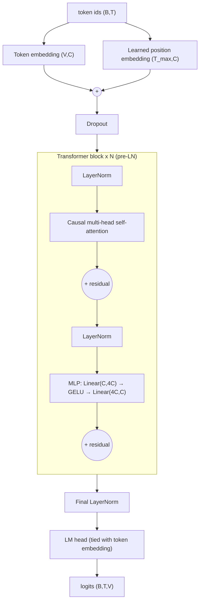

# mini-gpt2

A compact, from-scratch **GPT-2-style decoder-only Transformer** in PyTorch, designed to be trained locally on a
6 GB consumer GPU (target: RTX 3050 Laptop, i7-13650H, 24 GB RAM) and to serve as a small **language-model research
platform**: real byte-level BPE tokenizer, dataset pipeline, training loop, evaluation, KV-cached generation,
benchmarks, tests and controlled-experiment configs.

* The Transformer is implemented manually (no `transformers` model, no pretrained weights).
* Hugging Face libraries are used only for the `tokenizers` BPE trainer (and optionally `datasets`).
* Default model: 6 layers, 384 dim, 6 heads, context 256, vocab 32k → **23.03 M parameters** with tied embeddings
  (35.3 M untied; see [Parameter count](#parameter-count)).

> **Status honesty.** Everything here was developed and tested on a CPU-only sandbox (1 core, 3 GB RAM). CUDA code
> paths (bf16/fp16 autocast, GradScaler, fused AdamW, VRAM reporting, `--auto-batch-size`) are implemented but
> **could not be executed there**. [`outputs/research_report.md`](outputs/research_report.md) lists exactly what was
> run and measured, and the exact commands to run the rest on your RTX 3050.

---

## 1. Quick start

```bash
python -m venv .venv && source .venv/bin/activate        # Windows: .venv\Scripts\activate
# CUDA build of PyTorch: pick the command for your CUDA version at https://pytorch.org/get-started/locally/
pip install -r requirements.txt
pip install -e .                                         # optional; scripts also work without installing

python scripts/prepare_data.py --config configs/small.yaml        # download + clean + split WikiText-2
python scripts/train_tokenizer.py --config configs/small.yaml     # byte-level BPE, 32k vocab, train split only
python scripts/inspect_model.py --config configs/small.yaml       # params / memory / FLOPs estimates
pytest -q                                                         # unit tests (~6 s on CPU)
python scripts/overfit.py                                         # must pass before real training
python scripts/train.py --config configs/tiny.yaml                # ~4 min CPU smoke run
python scripts/train.py --config configs/small.yaml --auto-batch-size   # the real run (GPU)
tensorboard --logdir outputs/logs
python scripts/generate.py --checkpoint checkpoints/best.pt --prompt "Machine learning is" --max-new-tokens 100 --temperature 0.8 --top-k 50
python scripts/evaluate.py --checkpoint checkpoints/best.pt
python scripts/benchmark.py --config configs/small.yaml
```

Resume: `python scripts/train.py --config configs/small.yaml --resume checkpoints/latest.pt`
Override anything: `--override training.learning_rate=6e-4 model.context_length=512`.

## 2. Repository map

```
configs/        base.yaml (all defaults) · small.yaml (RTX 3050 default) · tiny.yaml (tests/debug) · experiments/*.yaml
src/mini_gpt/   config · model/ (embeddings, attention, mlp, block, transformer, gpt) · tokenizer/ · data/ · training/
                generation/ · evaluation/ · utils/
scripts/        prepare_data · train_tokenizer · train · evaluate · generate · inspect_model · benchmark · overfit
tests/          tokenizer, attention (causality!), model, dataset, generation, training (incl. end-to-end + resume)
docs/           architecture · attention · training · tokenizer · evaluation · memory · experiments
outputs/        runs/<timestamp>_<exp>/ (config, metrics.json, training.log, samples, plots) · logs/ (TensorBoard) · research_report.md
```

## 3. The architecture in one picture



Concepts, each with the equations and the exact tensor shapes in [`docs/`](docs):

| Topic | Where |
|---|---|
| GPT-2 / Transformer, LayerNorm, MLP, residuals, init, weight tying | [architecture.md](docs/architecture.md) |
| Causal self-attention, multi-head, manual vs SDPA, KV cache, RoPE | [attention.md](docs/attention.md) |
| Next-token prediction, cross-entropy, backprop, AdamW, LR schedule, mixed precision, grad accumulation | [training.md](docs/training.md) |
| Why byte-level BPE (not BERT-style) | [tokenizer.md](docs/tokenizer.md) |
| Perplexity, bits/token, splits, leakage | [evaluation.md](docs/evaluation.md) |
| What needs memory on a 6 GB GPU; FLOPs | [memory.md](docs/memory.md) |
| Experiments with hypotheses and variables | [experiments.md](docs/experiments.md) |

### Key design decisions (short)

* **Pre-LayerNorm**, GELU MLP (exact erf by default; `activation: gelu_new` = GPT-2's tanh approximation).
* **Learned positions** by default; **RoPE** is optional (`position_encoding.type: rope`) and tested for the relative-position property.
* **Init**: N(0, 0.02) everywhere; residual-writing projections (`attn.c_proj`, `mlp.c_proj`) use `0.02/√(2·L)` (GPT-2 paper) so the residual-stream variance does not grow with depth; LayerNorm = (1, 0); biases 0.
* **Weight tying** (`tie_embeddings: true`) — saves V·C = 12.3 M parameters; also a good prior since input and output token spaces are the same.
* **Attention**: `auto` → `F.scaled_dot_product_attention` (may use a fused/flash kernel on CUDA; never materialises T×T) else the explicit `manual` implementation. Both are tested equal to 1e-5.
* **AdamW** (0.9, 0.95, eps 1e-8, wd 0.1) with weight decay only on ≥2-D tensors.
* **Precision**: BF16 if the GPU *reports* support, else FP16 + GradScaler, else FP32. CPU runs FP32.
* **Loss** is computed in ≥FP32 even under autocast.
* **Data**: official WikiText-2 splits; tokenizer trained on the *train split only*; each article followed by `<eos>`; non-overlapping chunks of `context_length`, targets shifted by one.

## 4. Hardware & memory (RTX 3050 6 GB)

Rough per-step footprint for the default model at micro-batch 8, T=256 (`scripts/inspect_model.py`):
weights 88 MB + grads 88 MB + AdamW states 176 MB + activations ~150–240 MB + fp32 logits ~500 MB ≈ **1.0–1.1 GB**,
so the default should fit comfortably; `--auto-batch-size` halves the micro-batch until a forward/backward fits (and raises accumulation to keep the effective batch)
(it catches **only** `torch.cuda.OutOfMemoryError`; any other exception propagates). These are **estimates** —
measure with `scripts/benchmark.py`. The logits tensor `B·T·V` is the largest single activation with a 32k vocab.

Effective batch is always reported: `micro-batch × accumulation` sequences and `× context_length` tokens per update
(default `8 × 8 × 256 = 16,384`).

## 5. Parameter count

| config | params (tied) | params (untied) |
|---|---|---|
| tiny (vocab 8k, ctx 128, d 192, L 4) | 3.34 M | 4.88 M |
| small/default (vocab 32k, ctx 256, d 384, L 6) | **23.03 M** | 35.32 M |

The task description estimated 25–35 M; with tied embeddings the default is 23.0 M, untied it is 35.3 M. Set
`model.tie_embeddings: false` for the larger figure.

## 6. Reproducibility

`--seed N` seeds Python, NumPy, PyTorch and CUDA; `--deterministic` additionally requests deterministic kernels.
Results are **repeatable in practice but not guaranteed bit-identical** on GPU (non-deterministic atomics, SDPA
backend selection, cuDNN autotuning). Resuming from a checkpoint restores weights/optimizer/scheduler/RNG but
re-shuffles the data order, so a resumed run is statistically equivalent, not bit-identical, to an uninterrupted one.

## 7. Datasets

* `wikitext2` (default): downloaded from the official-split files in `pytorch/examples` (word-tokenised variant;
  we de-tokenise `@-@`, spacing before punctuation, etc.). Literal `<unk>` strings from WikiText are kept in the text
  and map to the tokenizer's `<unk>` special token (they are dropped when decoding).
* `tinyshakespeare`: 1.1 MB, contiguous 90/5/5 split.
* `custom`: any `.txt` (`data.custom_path`), contiguous 90/5/5 split at paragraph boundaries (so near-duplicate
  neighbours cannot straddle splits). For WikiText-103 / OpenWebText / TinyStories, export to a `.txt` and use `custom`
  (or add a loader in `data/preprocessing.py`); they are larger than the fast first-experiment target.

## 8. Tests

`pytest -q` — 66 tests including: encode→decode, **future-token invariance of causal attention** (manual, SDPA,
learned and RoPE), attention-matrix is lower-triangular and rows sum to 1, manual≡SDPA, **KV-cache≡full forward**,
shapes, finite loss ≈ ln V at init, gradients for every parameter, weight tying, closed-form parameter count,
gradient accumulation ≡ large batch, gradient checkpointing ≡ plain backward, float64 finite-difference gradient
check, checkpoint round-trip, overfitting a tiny sentence, and an end-to-end train→eval→checkpoint→resume run.
Deliberately breaking the mask makes 10 attention tests fail (checked during development).

## 9. Limitations

* A 23 M-parameter model trained for a few 10⁸ tokens on WikiText-2 will not be a capable general model; the goal is
  learning and controlled experiments, not reproducing GPT-2.
* WikiText-2 is ~2.2 M training tokens with the 32k tokenizer: 10k steps × 16k tokens = 164 M tokens ≈ 74 epochs → expect
  overfitting; watch validation loss and use `best.pt`. Use a bigger corpus for scaling experiments.
* Perplexity is per BPE token of *our* tokenizer — not comparable to published word-level WikiText numbers.
* Reported FLOPs/memory figures are model-based estimates.

## 10. License

MIT.
